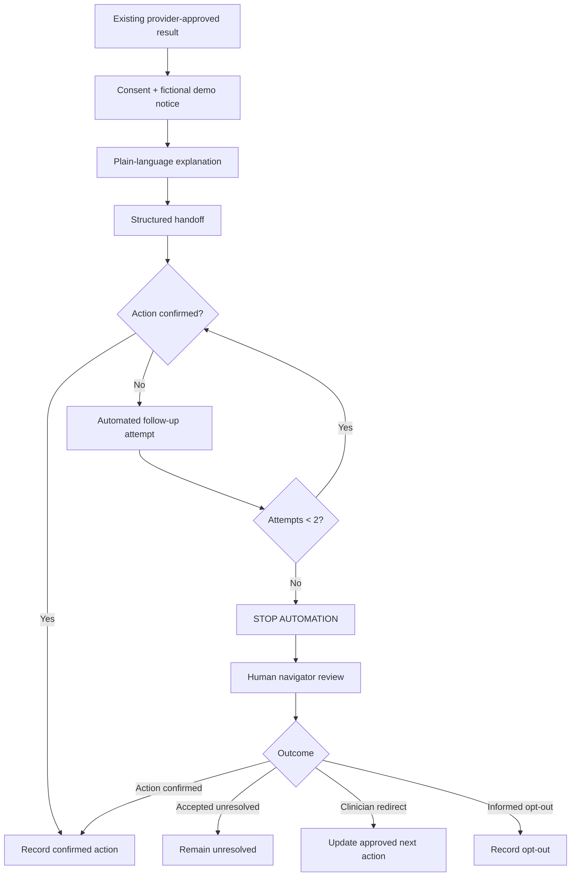
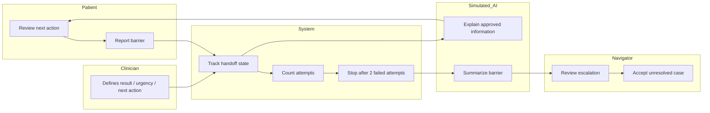

# NextCare MX — BUSINESS BENDING WEEK 5

Student: Emiliano Carballido  
Lens: Technologist  
Theme: When Care Arrives Too Late — or Through a Screen

## Problem in my words
My first instinct was to improve AI detection. I changed my position: the prediction is not the product. The product should be the pathway from an existing abnormal screen to a real next medical action. In Mexico, an abnormal result can create fear without creating an appointment, affordable treatment, or a person accountable for the handoff.

## Exact user
Lucía Hernández is a fictional 55-year-old informal worker in Mexico who mainly uses WhatsApp. She receives an existing provider-approved abnormal retinal screening result related to diabetes screening. NextCare MX does not generate or reinterpret the medical result. It helps her understand and complete the approved next step.

## Success definition
Before the module closes, a fictional abnormal-screening case can move through an accountable handoff containing: Next Action, Owner, Deadline, Status, Barrier, and Escalation. After two unsuccessful automated contact attempts, automation must stop and human navigator review must be required. Human acceptance cannot falsely mark the case resolved.

## Structured signal
The structured signal is the handoff state: approved result, next action, owner, deadline, status, barrier, contact-attempt count, and escalation state. The signal changes product behavior: 0–1 attempts allow follow-up; 2 attempts stop automation and trigger human review.

## LLM role
For this prototype, AI guidance is simulated and labeled on screen. It converts approved structured information into plain-language navigation support and a barrier summary. It never diagnoses, chooses treatment, or determines clinical urgency.

## Flow

## Swimlane

## Image-generated mockup

The following mockup was generated before implementation and used as the visual target for the prototype. All patient information shown is fictional.

## Benchmark line
Best benchmark: Aidoc Patient Management, because it treats findings as the beginning of follow-up workflow rather than the end. NextCare MX differs by testing a lighter Mexico-oriented, phone-first navigation layer that does not assume a deeply integrated hospital EHR environment.

## Scope cut
Building: one fictional case, structured handoff, barrier selector, attempt counter, two-attempt escalation, simulated AI navigation output, and navigator acceptance. Not building: symptom checker, diagnosis, raw-image analysis, medical risk score, treatment recommendation, real patient storage, hospital integration, insurance approval, payment, or appointment guarantees.

## Architecture + stack
| Layer | Choice | Purpose |
|---|---|---|
| Frontend | HTML/CSS/JavaScript | Fast, free prototype |
| Signal | Validated in-browser structured state | Tracks handoff |
| AI | Simulated output, visibly labeled | Plain-language navigation |
| Persistence | None | Minimize privacy risk |
| Hosting | Vercel target | Public demo |
| Repository | GitHub | Evidence and commit history |

## Security floor
No secrets are needed for the simulated-AI version. No data is stored. No real patient data appears. The demo is explicitly fictional. Form values are restricted to predefined options and state transitions. If a real LLM API is added later, its key must live only in Vercel environment variables and the server must validate all input.

## Blueprint conditions
1. Clinical boundary: existing approved result only; no diagnosis or urgency decisions.
2. Owned handoff: Next Action + Owner + Deadline + Status + Barrier + Escalation.
3. Human escalation: automation stops after two failed attempts.
4. Honest access: no promise of appointment, coverage, or capacity.
5. Measurable operation: measure completed/accepted handoffs, not messages sent.
6. Shadow clause: coordination cannot replace care or become surveillance; fictional data only, minimal data, no health score, no automatic family assignment.

## Test plan
1. Initial case renders all handoff fields.
2. First failed attempt increments count and keeps automation available.
3. Second failed attempt disables automated follow-up and requires human review.
4. Navigator acceptance keeps case explicitly unresolved.
5. Changing barrier updates patient and navigator context.
6. Clinical-boundary disclaimer remains visible.
7. Fictional-demo and simulated-AI labels remain visible.
8. Responsive layout remains usable on mobile.

## Long view
If this slice worked, NextCare MX could become a lightweight navigation layer connecting existing screening programs to verified next clinical actions across fragmented Mexican healthcare pathways. It would connect validated screening channels, clinics, pharmacies, public routes and human navigators without pretending software creates capacity. Success would be measured by whether people complete the crossing from detection to care without losing the human being afterward.
